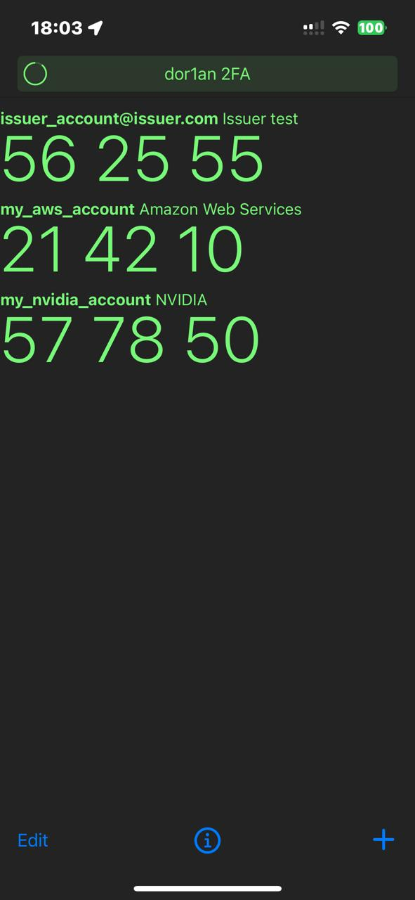
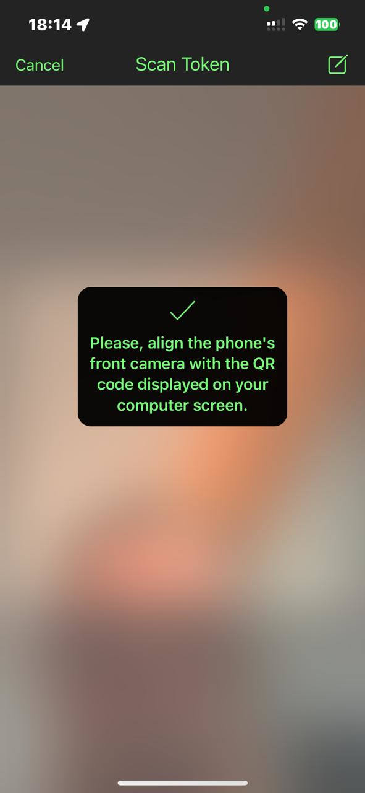
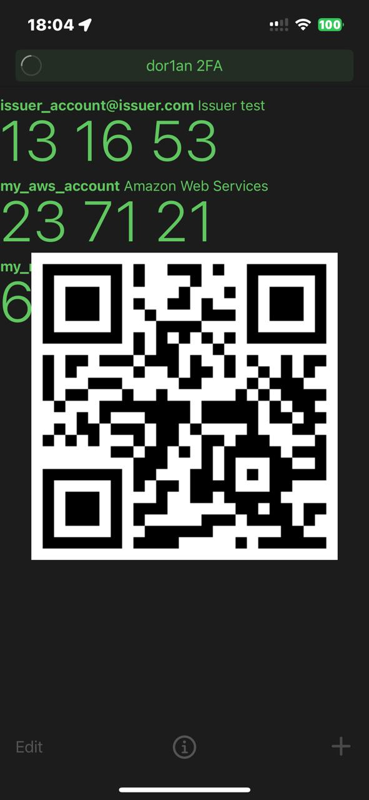
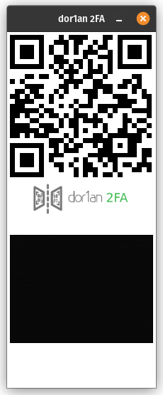

# dor1an 2FA
### Two-Factor Authentication Client for iOS.

dor1an2FA is a simple, free, and open source [two-factor authentication](https://en.wikipedia.org/wiki/Two-factor_authentication) app
based on [Matt Rubin's Authenticator](https://github.com/mattrubin/Authenticator) with a twist.
It is combined with a [browser extension](https://github.com/ch4r1i3b/dor1an2FA-chrome-extension) in order to talk each other via screen-camera communication.

dor1an2FA has all the advantages of Matt Rubin's Authenticator, like helping to keep your online accounts secure by generating unique one-time passwords, which you use in combination with your other passwords to log into supporting websites. 

**Original Matt Rubin's Authenticator features**:

- Easy: Simple setup via QR code, ["otpauth://" URL](https://code.google.com/p/google-authenticator/wiki/KeyUriFormat), or manual entry
- Secure: All data is stored in encrypted form on the iOS keychain
- Compatible: Full support for [time-based](https://tools.ietf.org/html/rfc6238) and [counter-based](https://tools.ietf.org/html/rfc4226) one-time passwords as standardized in RFC 4226 and 6238
- Off the Grid: The app never connects to the internet, and your secret keys never leave your device.


**Added dor1an2FA features**:
- Ability to transfer the generated 6-digit password token to the laptop automatically via screen-camera communication.
- No need to type the codes.
- Requester hostname check in order to minimize phishing attacks.
- Browser extension for 6-digit password token autofill.

 &nbsp;
 &nbsp;




## Getting Started

1. Check out the latest version of the project:
  ```
  git clone https://github.com/ch4r1i3b/dor1an2FA.git
  ```

2. In the dor1an2FA directory, check out the project's dependencies:
  ```
  cd dor1an2FA
  git submodule update --init --recursive
  ```

3. Open the `dor1an2FA.xcworkspace` file.
> If you open the `.xcodeproj` instead, the project will not be able to find its dependencies.

4. Build and run the "dor1an2FA" scheme.


## Managing Dependencies

dor1an2FA, like Authenticator, uses [Carthage] to manage its dependencies, but it does not currently use Carthage to build those dependencies. The dependency projects are checked out as submodules, are included in `dor1an2FA.xcworkspace`, and are built by Xcode as target dependencies of the Authenticator app.

To check out the dependencies, simply follow the "Getting Started" instructions above.

To update the dependencies, modify the [Cartfile] and run:
```
carthage update --no-build --use-submodules
```

[Carthage]: https://github.com/Carthage/Carthage
[Cartfile]: Cartfile

## Usage

### Install

1. Follow the steps in **Getting Started**.

2. Connect your iPhone to Xcode.

3. Download and install [dor1an2FA Chrome Extension](https://github.com/ch4r1i3b/dor1an2FA-chrome-extension).

### Setup

4. Add 2FA authentication of your 2FA requesting site to dor1an2FA (main screen, **+** button)

    a. Scan the QR code of the 2FA requesting site, or

    b. Add the parameters manually.

5. Edit the token you added (main screen, **Edit** button) and add the hostname of the 2FA requesing site.

### Authenticate

6. Navigate to the login page of the site where you need to authenticate using the second factor.

7. Enter you username and password as allways.

8. When you reach the page that is requesting for the second factor, the browser will pop up the extension window showing a QR (with the coded hostname) and starting the laptop camera.

9. Open dor1an2FA on your phone, and click on the token of that site.

10. Align the phone's front camera with the QR code displayed on the laptop screen.

11. dor1an2FA will check if the hostname matches, if not it will pop an error message.

12. If they are the same, dor1an2FA will show another QR code, this time the qr-coded 6-digit of the password token.

13. The browser extension will scan the QR code, decode it to the 6-digit of the password token and enter it to the textbox of the site.

14. You are in!

## License

This project is made available under the terms of the [MIT License](https://opensource.org/licenses/MIT).

dor1an2FA is mainly based on Matt Rubin Authenticator under the terms of the [MIT License](https://opensource.org/licenses/MIT).

